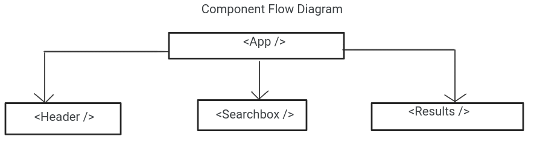
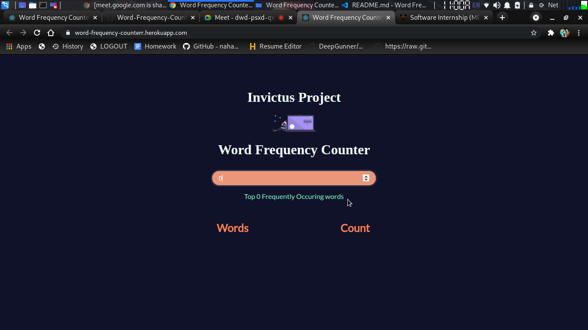
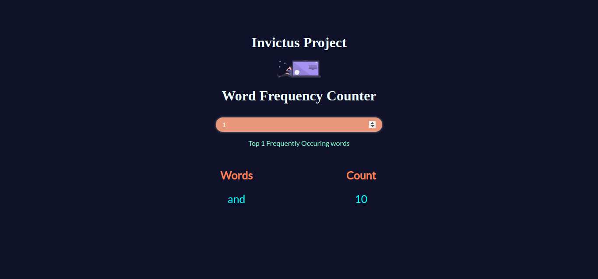
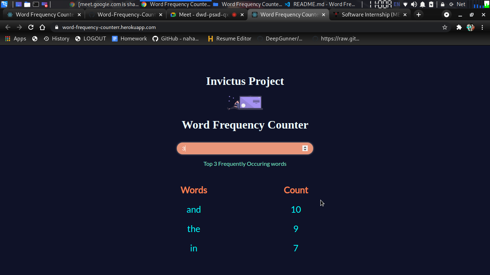
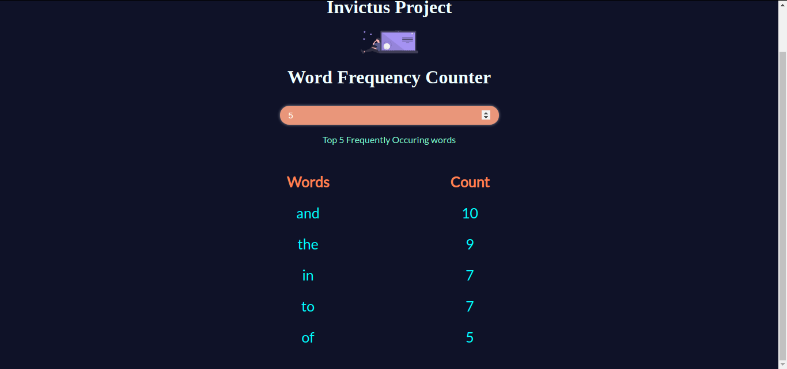

# Heroku deplyed live app link
https://word-frequency-counterr.herokuapp.com/

# Word Frequency Counter

The objective is to fetch the data from the following MarkDown File and display N^ number of words in a tabular form
# Installation:

```$ git clone https://github.com/vighnesh777/Word-Frequency-Counter.git```

```$ npm install```

```$ npm start```

#### MarkDown File 
 "https://raw.githubusercontent.com/invictustech/test/main/README.md"

# Component Flow Diagram


## Resources used

"https://fonts.googleapis.com/css2?family=Lato&family=Raleway&display=swap" rel="stylesheet"
https://user-images.githubusercontent.com/26179770/106359099-693e3380-6336-11eb-8069-9e36f25de5ca.png

# Code Components:


```
    function giveFreq() {
        for (let i = 0; i <= textArr.length; i++) {
            obj[textArr[i]] = 0;
        }
        for (let i = 0; i <= textArr.length; i++) {
            obj[textArr[i]]++;
        }

        return obj;
    }
```
In giveFreq() function the text received from the url is stored in text and then split after each white space
and stored in object. The text raw data is fetched from the url using fetch code component which is is used under componentDidMount()

```
 async componentDidMount() {
        await fetch(reqUrl)
            .then(res => res.text())
            .then(data => this.setState({ data: data }))
    }
```
The entered input is the stored in the inputNum variable in the state
```
handleInputChange = async (inputText) => {
        await this.setState({
            headerExpanded: !inputText,
            inputNum: inputText
        });

    }
```
# Test Cases With Screenshots
 If the number entered is less than or equal to 0:
 

 

 When entered number is greater than 0 the table is displayed
 

 

 

